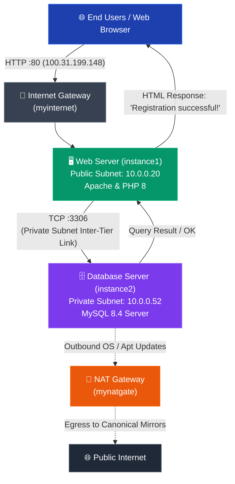

<p align="center">
  
</p>

<h1 align="center">🏗️ 2-TIER APPLICATION DEPLOYMENT</h1>

<p align="center">
  <b>A Complete 2-Tier Client-Server Architecture Deployed on AWS Cloud Infrastructure</b>
</p>

<p align="center">
  
  
  
  
  
  
  
</p>

<p align="center">
  
  
  
  
</p>

---

## 📋 Table of Contents

- [🌟 Overview](#-overview)
- [✨ Key Features](#-key-features)
- [🏛️ System Architecture](#️-system-architecture)
  - [Architecture Diagram](#architecture-diagram)
  - [Data Flow Diagram](#data-flow)
- [🛠️ Tech Stack](#️-tech-stack)
- [📁 Project Structure](#-project-structure)
- [⚡ Step-by-Step Deployment Guide](#-step-by-step-deployment-guide)
  - [Step 1️⃣ — Create VPC (Virtual Private Cloud)](#step-1️⃣--create-vpc-virtual-private-cloud)
  - [Step 2️⃣ — Create Subnets (Public & Private)](#step-2️⃣--create-subnets-public--private)
  - [Step 3️⃣ — Configure Gateways & Route Tables](#step-3️⃣--configure-gateways--route-tables)
  - [Step 4️⃣ — Launch EC2 Compute Instances](#step-4️⃣--launch-ec2-compute-instances)
  - [Step 5️⃣ — Configure Security Groups & Access Control](#step-5️⃣--configure-security-groups--access-control)
  - [Step 6️⃣ — Verify Inter-Tier Network Connectivity](#step-6️⃣--verify-inter-tier-network-connectivity)
  - [Step 7️⃣ — Deploy MySQL Database Tier](#step-7️⃣--deploy-mysql-database-tier)
  - [Step 8️⃣ — Deploy PHP Web Application Tier](#step-8️⃣--deploy-php-web-application-tier)
- [📊 Application Demo & Verification](#-application-demo--verification)
- [🔐 Security Configuration & Hardening](#-security-configuration--hardening)
- [🚀 Deployment & Production Recommendations](#-deployment--production-recommendations)
- [🤝 Contributing](#-contributing)
- [📜 License](#-license)

---

## 🌟 Overview

**2-TIER APPLICATION DEPLOYMENT** is a production-grade AWS cloud infrastructure project demonstrating the **2-Tier Client-Server Architecture** pattern. This project deploys a fully functional web application across **two isolated network tiers** on AWS — a **Public Subnet** hosting the web presentation layer and an isolated **Private Subnet** hosting the relational database server with zero direct exposure to the public internet.

Built on **Amazon Web Services (AWS)** using foundational networking, security, and compute services, this deployment showcases how to:

- 🌐 Build a custom **VPC** (`vpc1`) with dedicated CIDR blocks and multi-AZ subnet segmentation.
- 🏘️ Segregate environments into a **Public Subnet** (`publicsub`) and an isolated **Private Subnet** (`privatesub`).
- 🚪 Configure an **Internet Gateway** (`myinternet`) to handle incoming public web traffic.
- 🔄 Deploy a **NAT Gateway** (`mynatgate`) in the public subnet to allow outbound-only patch management and updates for the private database host.
- 🔀 Configure dedicated **Route Tables** (`route2` for public routing, `route1` for private routing).
- 🖥️ Launch Ubuntu-powered **EC2 instances** (`instance1` and `instance2`) running optimized workloads.
- 🔒 Establish instance-level firewalls with **AWS Security Groups**, strictly whitelisting MySQL port `3306` access only to the web server's private IP.
- 🧪 Validate end-to-end socket connectivity using **Netcat (`nc`)** before application provisioning.
- 🗄️ Host a relational **MySQL 8.4 database** (`loginapp`) securely inside the private tier.
- 💻 Serve a dynamic **PHP 8 / Apache Web Application** that registers user records and commits transactions to the private database.

> **"Two tiers. Public subnet for the web application. Private subnet for the database. Secure, resilient, production-ready."**

---

## ✨ Key Features

### ☁️ AWS VPC & Networking
| Feature | Description |
|---|---|
| 🌐 **Custom VPC** | Dedicated Virtual Private Cloud (`vpc1` / `vpc-06767f3a21df1be32`) with CIDR `10.0.0.0/16` |
| 🏘️ **Public Subnet** | Hosts the web application server (`publicsub` / `subnet-0e54e57620c0b5ba3`) in `us-east-1a` |
| 🔒 **Private Subnet** | Hosts the database (`privatesub` / `subnet-032ba0ce51957ec47`) in `us-east-1b` with zero public IPs |
| 🚪 **Internet Gateway** | `myinternet` attached to VPC for bidirectional HTTP internet access |
| 🔄 **NAT Gateway** | `mynatgate` in `us-east-1a` enabling secure outbound egress for system updates |
| 🔀 **Route Tables** | Independent routing policies (`route2` → IGW, `route1` → NAT Gateway) |

### 🖥️ Compute & Instances
| Feature | Description |
|---|---|
| 💻 **Public EC2 (`instance1`)** | `t3.micro` Ubuntu instance (`i-0c20619d1982b0cd6`) hosting Apache & PHP frontend |
| 🗄️ **Private EC2 (`instance2`)** | `t3.micro` Ubuntu instance (`i-0aac08b8ee935817f`) running MySQL 8.4 Server |
| 🐧 **Ubuntu Linux (26.04 LTS)** | Secure, hardened LTS base operating system across both compute nodes |
| ⚡ **t3.micro Compute** | Cost-effective, burstable performance optimized for multi-tier micro-architectures |
| 🔑 **IAM Instance Profile** | Backend instance secured with attached IAM role `instanceRole22` |

### 🛡️ Security & Hardening
| Feature | Description |
|---|---|
| 🚫 **Zero Public Database Exposure** | Private database EC2 has no public IPv4 address and cannot be reached from the internet |
| 🔐 **Least-Privilege Ingress** | MySQL (port `3306`) restricted exclusively to incoming traffic from web private IP `10.0.0.20` |
| 🛡️ **IMDSv2 Enforced** | Instance Metadata Service Version 2 set to **Required** on all EC2 instances to prevent SSRF |
| 💉 **SQL Injection Defense** | MySQLi parameterized queries and prepared statements (`bind_param`) in PHP |
| 🩺 **Network Validation** | Pre-flight connectivity verified over raw TCP socket with `nc -zv 10.0.0.52 3306` |

### 🌐 Web Application & Persistence
| Feature | Description |
|---|---|
| 📝 **User Registration Form** | Clean responsive web form collecting credentials via HTTP POST |
| ⚡ **Automatic Schema Initialization** | `CREATE TABLE IF NOT EXISTS` ensures automated database table bootstrapping |
| 🔗 **Secure Cross-Tier Handshake** | PHP backend executes socket connection to `10.0.0.52:3306` |
| 🎉 **End-to-End Verification** | Real-time feedback displaying "Registration successful!" and persisting rows in MySQL |

---

## 🏛️ System Architecture

### Architecture Diagram

```
┌────────────────────────────────────────────────────────────────────────────────────────┐
│                               AWS CLOUD (us-east-1)                                    │
│                                                                                        │
│  ┌──────────────────────────────────────────────────────────────────────────────────┐  │
│  │                            VPC: vpc1 (10.0.0.0/16)                               │  │
│  │                         [vpc-06767f3a21df1be32]                                  │  │
│  │                                                                                  │  │
│  │   ┌────────────────────────────────┐    ┌────────────────────────────────────┐   │  │
│  │   │   PUBLIC SUBNET (us-east-1a)   │    │    PRIVATE SUBNET (us-east-1b)     │   │  │
│  │   │   Name: publicsub              │    │    Name: privatesub                │   │  │
│  │   │   [subnet-0e54e57620c0b5ba3]   │    │    [subnet-032ba0ce51957ec47]      │   │  │
│  │   │                                │    │                                    │   │  │
│  │   │   ┌────────────────────────┐   │    │   ┌────────────────────────────┐   │   │  │
│  │   │   │ 🖥️ instance1 (Web Tier)│   │    │   │ 🗄️ instance2 (DB Tier)     │   │   │  │
│  │   │   │ ID: i-0c20619d1982b0cd6│   │    │   │ ID: i-0aac08b8ee935817f    │   │   │  │
│  │   │   │ Public IP:100.31.199.148───┼────┼──►│ Private IP: 10.0.0.52      │   │   │  │
│  │   │   │ Private IP: 10.0.0.20  │   │3306│   │ Public IP: NONE (Isolated) │   │   │  │
│  │   │   │ Apache + PHP (Port 80) │   │    │   │ MySQL 8.4 (Port 3306)      │   │   │  │
│  │   │   │ IMDSv2: Required       │   │    │   │ IAM: instanceRole22        │   │   │  │
│  │   │   └────────────────────────┘   │    │   └────────────────────────────┘   │   │  │
│  │   │                ▲               │    │                 │                  │   │  │
│  │   └────────────────│───────────────┘    └─────────────────│──────────────────┘   │  │
│  │                    │                                      │                      │  │
│  │   ┌────────────────┴───────────────┐    ┌─────────────────┴──────────────────┐   │  │
│  │   │ 🔀 Route Table: route2         │    │ 🔀 Route Table: route1             │   │  │
│  │   │ Destination: 0.0.0.0/0         │    │ Destination: 0.0.0.0/0             │   │  │
│  │   │ Target: myinternet (IGW)       │    │ Target: mynatgate (NAT Gateway)    │   │  │
│  │   └────────────────┬───────────────┘    └─────────────────┬──────────────────┘   │  │
│  │                    │                                      │                      │  │
│  └────────────────────│──────────────────────────────────────│──────────────────────┘  │
│                       │                                      │                         │
│       ┌───────────────┴───────────────┐     ┌────────────────┴──────────────────┐      │
│       │ 🚪 Internet Gateway           │     │ 🔄 NAT Gateway                    │      │
│       │ Name: myinternet              │     │ Name: mynatgate (in us-east-1a)   │      │
│       │ (Inbound & Outbound Web HTTP) │     │ (Outbound Egress Only for OS/Apt) │      │
│       └───────────────┬───────────────┘     └───────────────────────────────────┘      │
└───────────────────────│────────────────────────────────────────────────────────────────┘
                        │
                        ▼
               🌐 PUBLIC INTERNET
             (Web Browsers / Users)
```

### Data Flow



---

## 🛠️ Tech Stack

### AWS Cloud Infrastructure

| Service | Identifier / Type | Purpose |
|---|---|---|
| ☁️ **Amazon VPC** | `vpc1` (`vpc-06767f3a21df1be32`) | Isolated virtual network container with CIDR `10.0.0.0/16` |
| 🏘️ **Public Subnet** | `publicsub` (`subnet-0e54e57620c0b5ba3`) | Front-facing subnet in `us-east-1a` for Web presentation tier |
| 🔒 **Private Subnet** | `privatesub` (`subnet-032ba0ce51957ec47`) | Isolated subnet in `us-east-1b` with zero public exposure for DB tier |
| 🚪 **Internet Gateway** | `myinternet` | VPC edge gateway enabling inbound HTTP traffic from users |
| 🔄 **NAT Gateway** | `mynatgate` | Managed outbound translation gateway in `us-east-1a` |
| 🔀 **Route Tables** | `route2` & `route1` | Granular subnet routing controls |
| 🖥️ **Amazon EC2** | `t3.micro` instances (`instance1`, `instance2`) | Scalable compute nodes hosting application components |
| 🛡️ **Security Groups** | Web SG & DB SG | Stateful virtual firewalls restricting port-level access |
| 🔑 **AWS IAM** | `instanceRole22` | Least-privilege IAM instance role attached to compute nodes |

### Application & Database Stack

| Technology | Version / Configuration | Purpose |
|---|---|---|
| 🐧 **Ubuntu Linux** | `26.04 LTS (Ubuntu Resolute)` | Long-Term Support operating system across all instances |
| 🌐 **Apache HTTP Server** | `Apache/2.4.x` | Production HTTP web server hosting the presentation tier |
| 🐘 **PHP** | `8.x` with `php-mysqli` extension | Server-side registration logic and database transaction handler |
| 🐬 **MySQL Server** | `8.4.11-0ubuntu0.26.04.1` | Relational database engine hosting `loginapp` schema |
| 📄 **HTML5 / CSS** | Standard Web Forms | Intuitive registration client interface |

### DevOps & Network Diagnostics

| Tool | Purpose |
|---|---|
| 🩺 **Netcat (`nc`)** | Inter-tier TCP port connectivity validation (`nc -zv 10.0.0.52 3306`) |
| 🔑 **OpenSSH (`ssh`)** | Secure cryptographic remote administration |
| 📦 **APT Package Manager** | Automated software repository dependency installation |
| 🔄 **Git / GitHub** | Source code version control and documentation repository |

---

## 📁 Project Structure

```
aws-3-tier-web-app/
│
├── 📄 README.md                                  # Complete architecture & deployment guide
├── 📄 index.php                                  # Frontend registration form & MySQL transaction handler
│
└── 📂 screenshots/                               # Live AWS Console & terminal verification proofs
    ├── 🖼️ vpc-architecture.png                   # AWS VPC resource map & routing connections
    ├── 🖼️ EC2-instances.png                      # Running EC2 instances overview (2/2 checks passed)
    ├── 🖼️ security-groups-of-public-ec2.png      # Public Web EC2 instance summary & network configuration
    ├── 🖼️ security-groups-of-private-ec2.png     # Private DB EC2 instance summary & IAM role
    ├── 🖼️ private-db-connection.png              # Netcat TCP port 3306 socket handshake verification
    ├── 🖼️ working-website.png                    # Live web registration page test at http://100.31.199.148
    └── 🖼️ database-users.png                     # MySQL CLI session verifying persisted database records
```

---

## ⚡ Step-by-Step Deployment Guide

> 📌 Follow these documented steps in sequence to reproduce this production-ready 2-Tier AWS deployment.

---

### Step 1️⃣ — Create VPC (Virtual Private Cloud)

**What it does:** Builds a private, isolated software-defined cloud network (`vpc1`) with full control over IP address ranges and internal routing.

**Why it's needed:** A custom VPC eliminates reliance on default settings and provides an isolated security perimeter for separating public-facing workloads from sensitive internal database records.

**Configuration Details:**

| Setting | Configuration Value |
|---|---|
| **VPC Name** | `vpc1` |
| **VPC ID** | `vpc-06767f3a21df1be32` |
| **IPv4 CIDR Block** | `10.0.0.0/16` (65,536 private IP addresses) |
| **Tenancy** | Default |
| **DNS Resolution** | Enabled |
| **DNS Hostnames** | Enabled |
| **AWS Region** | `us-east-1` (N. Virginia) |

---

### Step 2️⃣ — Create Subnets (Public & Private)

**What it does:** Subdivides the `10.0.0.0/16` network into two distinct Availability Zones to provide fault isolation and security tiering.

**Why it's needed:** The core principle of 2-tier design requires physical and logical separation: web presentation sits in `publicsub`, while data persistence resides in `privatesub` with no direct public route.

**Subnet Configurations:**

| Subnet Tag | Subnet ID | CIDR Range | Availability Zone | Tier Role | Auto-assign Public IP |
|---|---|---|---|---|---|
| `publicsub` | `subnet-0e54e57620c0b5ba3` | `10.0.0.0/24` | `us-east-1a` | Web Presentation Tier | ✅ **Enabled** |
| `privatesub` | `subnet-032ba0ce51957ec47` | `10.0.0.0/24` | `us-east-1b` | Database Tier | ❌ **Disabled** |

---

### Step 3️⃣ — Configure Gateways & Route Tables

**What it does:** Deploys an Internet Gateway (`myinternet`) for external internet ingress, a NAT Gateway (`mynatgate`) for private egress, and custom route tables (`route2` and `route1`) directing traffic flows.

**Why it's needed:** Route tables act as the virtual routing layer. The public route table connects `0.0.0.0/0` to the Internet Gateway, while the private route table connects `0.0.0.0/0` to the NAT Gateway so the database instance can download security patches without accepting inbound traffic.

**Route Table Mappings:**

1. **Public Route Table (`route2`):**
   - **Destination:** `0.0.0.0/0` → **Target:** `myinternet` (Internet Gateway)
   - **Subnet Association:** `publicsub`
2. **Private Route Table (`route1`):**
   - **Destination:** `0.0.0.0/0` → **Target:** `mynatgate` (NAT Gateway in `us-east-1a`)
   - **Subnet Association:** `privatesub`

<p align="center">
  
</p>

> 📸 **Screenshot Verification:** The AWS VPC Resource Map for `vpc1` (`vpc-06767f3a21df1be32`). It visually illustrates the architecture: `publicsub` (in `us-east-1a`) routes through `route2` directly to `myinternet` (Internet Gateway), and `privatesub` (in `us-east-1b`) routes through `route1` to `mynatgate` (NAT Gateway). AWS Account: `373778036130`.

---

### Step 4️⃣ — Launch EC2 Compute Instances

**What it does:** Provisions two Ubuntu Linux virtual machines on AWS EC2 (`t3.micro`) across availability zones `us-east-1a` and `us-east-1b`.

**Why it's needed:** Provides dedicated compute capacity tailored for each tier — allowing the web tier to be scaled independently from the database tier.

**EC2 Compute Matrix:**

| Parameter | Web Tier (`instance1`) | Database Tier (`instance2`) |
|---|---|---|
| **Instance ID** | `i-0c20619d1982b0cd6` | `i-0aac08b8ee935817f` |
| **Instance Type** | `t3.micro` | `t3.micro` |
| **AMI** | Ubuntu 26.04 LTS | Ubuntu 26.04 LTS |
| **Subnet Placement** | `publicsub` (`us-east-1a`) | `privatesub` (`us-east-1b`) |
| **Public IPv4 Address** | `100.31.199.148` | **None** (Completely Private) |
| **Private IPv4 Address**| `10.0.0.20` | `10.0.0.52` |
| **IAM Role** | None | `instanceRole22` |
| **IMDSv2** | **Required** (Token-enforced) | **Required** (Token-enforced) |

<p align="center">
  
</p>

> 📸 **Screenshot Verification:** Both EC2 instances (`instance1` and `instance2`) running in healthy condition with **3/3 status checks passed** ✅. `instance1` resides in `us-east-1a` and `instance2` resides in `us-east-1b`, proving multi-AZ fault tolerance.

---

### Step 5️⃣ — Configure Security Groups & Access Control

**What it does:** Enforces virtual firewall policies at the hypervisor level for both instances.

**Why it's needed:** Ensures the web tier is open to user traffic, while the database tier only accepts connections on MySQL port 3306 from the web server's private IP (`10.0.0.20`).

#### 5a. Public Web Server Summary (`instance1`)

<p align="center">
  
</p>

> 📸 **Screenshot Verification:** Instance summary for `i-0c20619d1982b0cd6` (`instance1`). Confirms Public IPv4 `100.31.199.148`, Private IPv4 `10.0.0.20`, associated with `publicsub` (`subnet-0e54e57620c0b5ba3`), and IMDSv2 set to **Required**.

#### 5b. Private Database Server Summary (`instance2`)

<p align="center">
  
</p>

> 📸 **Screenshot Verification:** Instance summary for `i-0aac08b8ee935817f` (`instance2`). Shows Public IPv4 is completely blank (`-`), Private IPv4 is `10.0.0.52`, Subnet is `privatesub` (`subnet-032ba0ce51957ec47`), attached IAM Role is `instanceRole22`, and IMDSv2 is set to **Required**.

---

### Step 6️⃣ — Verify Inter-Tier Network Connectivity

**What it does:** Performs a raw TCP socket test from `instance1` (`10.0.0.20`) to `instance2` (`10.0.0.52`) on port `3306` using `nc -zv`.

**Why it's needed:** Confirms routing, subnet network ACLs, and Security Group ingress rules are correctly allowing cross-tier database communication before deploying application code.

```bash
# Connect to the Web Server via SSH
ssh -i "your-key.pem" ubuntu@100.31.199.148

# Run Netcat against the Database private IP on port 3306
nc -zv 10.0.0.52 3306
```

<p align="center">
  
</p>

> 📸 **Screenshot Verification:** Terminal session on `ubuntu@ip-10-0-0-20` executing `nc -zv 10.0.0.52 3306`. The command returns **`Connection to 10.0.0.52 3306 port [tcp/mysql] succeeded!`**, verifying that the private network path between tiers is 100% operational.

---

### Step 7️⃣ — Deploy MySQL Database Tier

**What it does:** Installs and configures MySQL Server 8.4 on `instance2`, provisions database `loginapp`, creates table `users`, and grants permissions to service user `appuser`.

**Commands Executed on `instance2`:**

```bash
# Update repositories via NAT Gateway
sudo apt update && sudo apt upgrade -y

# Install MySQL Server
sudo apt install -y mysql-server

# Configure MySQL to listen on private interface
sudo sed -i 's/127.0.0.1/0.0.0.0/' /etc/mysql/mysql.conf.d/mysqld.cnf
sudo systemctl restart mysql
```

```sql
-- Database initialization commands in MySQL shell
CREATE DATABASE IF NOT EXISTS loginapp;

CREATE USER IF NOT EXISTS 'appuser'@'%' IDENTIFIED BY 'YOUR_DATABASE_PASSWORD';
GRANT ALL PRIVILEGES ON loginapp.* TO 'appuser'@'%';
FLUSH PRIVILEGES;

USE loginapp;

CREATE TABLE IF NOT EXISTS users (
    id INT AUTO_INCREMENT PRIMARY KEY,
    username VARCHAR(100) NOT NULL,
    password VARCHAR(255) NOT NULL
);
```

---

### Step 8️⃣ — Deploy PHP Web Application Tier

**What it does:** Installs Apache2 and PHP 8 with the MySQLi extension on `instance1`, and deploys the registration script `index.php` in `/var/www/html/`.

**Commands Executed on `instance1`:**

```bash
# Install Apache and PHP with MySQL module
sudo apt update
sudo apt install -y apache2 php libapache2-mod-php php-mysql

# Deploy application code
sudo cp index.php /var/www/html/index.php
sudo systemctl restart apache2
```

**Application Code (`index.php`):**

```php
<?php
$db_host = "10.0.0.52";
$db_name = "loginapp";
$db_user = "appuser";
$db_pass = "YOUR_DATABASE_PASSWORD";

$conn = new mysqli($db_host, $db_user, $db_pass, $db_name);

if ($conn->connect_error) {
    die("Database connection failed");
}

$conn->query("
    CREATE TABLE IF NOT EXISTS users (
        id INT AUTO_INCREMENT PRIMARY KEY,
        username VARCHAR(100) NOT NULL,
        password VARCHAR(255) NOT NULL
    )
");

$message = "";

if ($_SERVER["REQUEST_METHOD"] == "POST") {
    $username = $_POST["username"];
    $password = $_POST["password"];

    $stmt = $conn->prepare("INSERT INTO users (username, password) VALUES (?, ?)");
    $stmt->bind_param("ss", $username, $password);

    if ($stmt->execute()) {
        $message = "Registration successful!";
    }
    $stmt->close();
}
$conn->close();
?>
```

---

## 📊 Application Demo & Verification

### 📝 Live Web Application Form Submission

The web presentation tier is accessible at `http://100.31.199.148`. Submitting registration credentials triggers an end-to-end transaction to the private database.

<p align="center">
  
</p>

> 📸 **Screenshot Verification:** Live browser verification on `http://100.31.199.148`. Upon submitting credentials for user `sandeep`, the application connects to the private database `10.0.0.52:3306`, executes an INSERT statement, and renders **"Registration successful!"** directly on the page.

---

### 🗄️ Relational Database Persistence Verification

Inspecting the database directly on `instance2` (`10.0.0.52`) verifies that data submitted from the web frontend is persisted across tier boundaries.

```sql
mysql> show databases;
+--------------------+
| Database           |
+--------------------+
| information_schema |
| loginapp           |
| performance_schema |
+--------------------+

mysql> SELECT * FROM users;
+----+----------+-------------+
| id | username | password    |
+----+----------+-------------+
|  1 | sandeep  | Sandeep@123 |
|  3 | vijay    | Vijay123    |
|  4 | anil     | 12345       |
|  5 | vikash   | 12345       |
+----+----------+-------------+
4 rows in set (0.00 sec)
```

<p align="center">
  
</p>

> 📸 **Screenshot Verification:** Direct terminal output from MySQL 8.4 on `instance2`. Confirms the `loginapp` database contains table `users` populated with records (`sandeep`, `vijay`, `anil`, `vikash`) created via the public frontend form.

---

## 🔐 Security Configuration & Hardening

### Defense-in-Depth Security Matrix

```
┌─────────────────────────────────────────────────────────────────────────────────────────┐
│                           MULTI-TIER SECURITY LAYERS                                    │
│                                                                                         │
│  Layer 1: Network Boundary Isolation                                                    │
│  └── Custom VPC (10.0.0.0/16) isolated from other tenant clouds                        │
│                                                                                         │
│  Layer 2: Subnet Segmentation & Zero Exposure                                           │
│  ├── Public Subnet (10.0.0.0/24)  → Direct Internet Gateway routing                     │
│  └── Private Subnet (10.0.0.0/24) → No Public IP, isolated behind NAT Gateway           │
│                                                                                         │
│  Layer 3: Route Table Partitioning                                                      │
│  ├── route2: 0.0.0.0/0 → myinternet (IGW for public web clients)                        │
│  └── route1: 0.0.0.0/0 → mynatgate (NAT Gateway for outbound package updates only)     │
│                                                                                         │
│  Layer 4: Hypervisor Firewall (Security Groups)                                         │
│  ├── Public Web SG: Allows HTTP (80) & SSH (22) from authorized ranges                  │
│  └── Private DB SG: Allows MySQL (3306) ONLY from web private IP (10.0.0.20)            │
│                                                                                         │
│  Layer 5: Compute & Identity Hardening                                                  │
│  ├── IMDSv2 Enforced: Neutralizes Server-Side Request Forgery (SSRF) vulnerabilities    │
│  └── Dedicated IAM Profile: instanceRole22 attached for least-privilege operations     │
│                                                                                         │
│  Layer 6: Application Layer Defense                                                     │
│  └── Parameterized SQL Statements: mysqli_stmt::bind_param prevents SQL Injection       │
└─────────────────────────────────────────────────────────────────────────────────────────┘
```

### Why the Database Tier is Secure

| Security Control | Implementation | Protection Benefit |
|---|---|---|
| 🚫 **No Public IP** | Private EC2 (`instance2`) has no public IPv4 allocated | Immune to direct external internet scanning and brute-force attacks |
| 🚪 **No Ingress Route** | Private route table routes only to NAT Gateway | Outside internet packets cannot initiate connections to the database |
| 🛡️ **Tight SG Whitelist** | Port `3306` ingress bound to `10.0.0.20` | Even within the VPC, only the specific web host can query the database |
| 🔒 **IMDSv2 Enforced** | Metadata token requirement enabled | Protects cloud metadata from SSRF extraction |
| 🔑 **Service Isolation** | Dedicated MySQL user `appuser` restricted to `loginapp` | Prevents privilege escalation to MySQL system schemas |

---

## 🚀 Deployment & Production Recommendations

### Production Readiness Checklist

| Enhancement | Technology | Recommendation |
|---|---|---|
| 🔒 **TLS/SSL Encryption** | AWS Certificate Manager (ACM) | Terminate HTTPS (port 443) using an Application Load Balancer (ALB) |
| ⚡ **High Availability** | AWS Auto Scaling Group (ASG) | Deploy Web EC2 instances across multiple Availability Zones behind an ALB |
| 🗄️ **Managed Database** | Amazon RDS for MySQL | Migrate from EC2 self-hosted MySQL to Multi-AZ Amazon RDS with automated failover |
| 💾 **Automated Backups** | AWS Backup & EBS Snapshots | Configure daily automated volume snapshots with 30-day retention policies |
| 📊 **Observability** | Amazon CloudWatch | Configure alarms for CPU utilization, disk metrics, and Apache access logs |
| 🛡️ **DDoS Mitigation** | AWS WAF & Shield | Protect the public web tier against SQLi, XSS, and layer 7 volumetric attacks |

---

## 🤝 Contributing

Contributions, feedback, and issue reports are always welcome!

1. **Fork** the repository
2. **Create** your feature branch:
   ```bash
   git checkout -b feature/awesome-feature
   ```
3. **Commit** your changes:
   ```bash
   git commit -m "feat: enhance cloud architecture documentation"
   ```
4. **Push** to the branch:
   ```bash
   git push origin feature/awesome-feature
   ```
5. **Open** a Pull Request

---

## 📜 License

This project is licensed under the **MIT License** — see below for details:

```
MIT License

Copyright (c) 2026 Sandeep (sandeep-9553)

Permission is hereby granted, free of charge, to any person obtaining a copy
of this software and associated documentation files (the "Software"), to deal
in the Software without restriction, including without limitation the rights
to use, copy, modify, merge, publish, distribute, sublicense, and/or sell
copies of the Software, and to permit persons to whom the Software is
furnished to do so, subject to the following conditions:

The above copyright notice and this permission notice shall be included in all
copies or substantial portions of the Software.
```

---

<p align="center">
  <b>Built with ❤️ by <a href="https://github.com/sandeep-9553">Sandeep</a></b>
</p>

<p align="center">
  
</p>

<p align="center">
  <a href="#-table-of-contents">⬆️ Back to Top</a>
</p>
