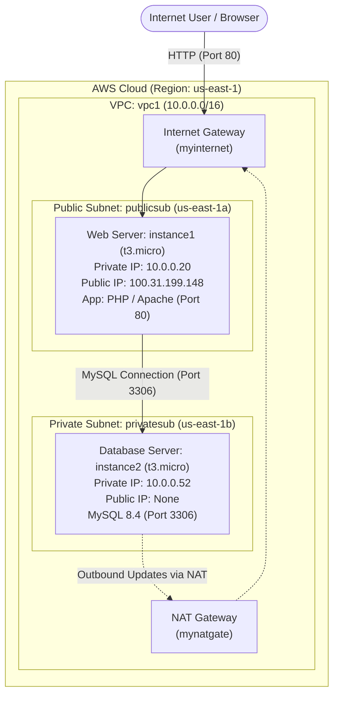
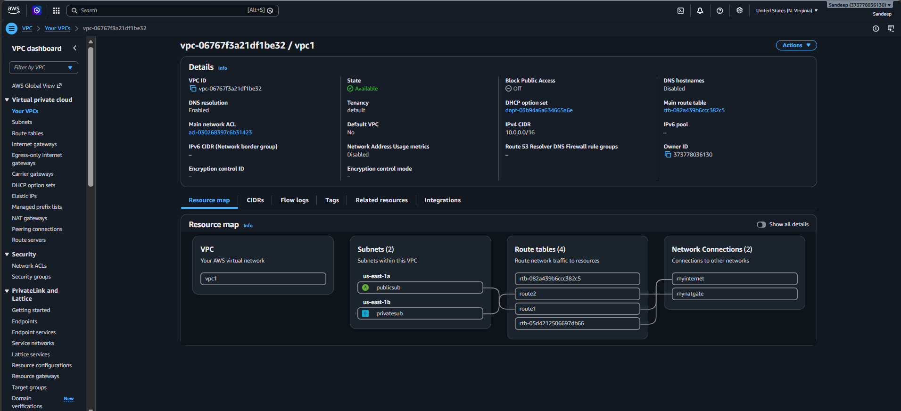
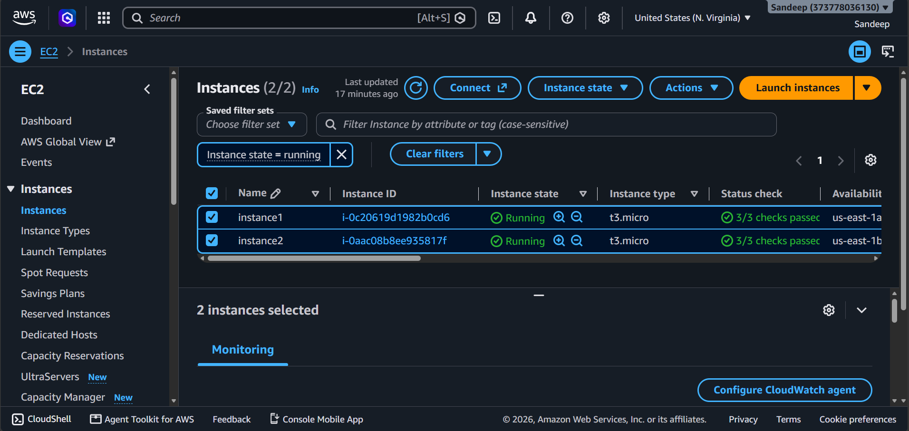
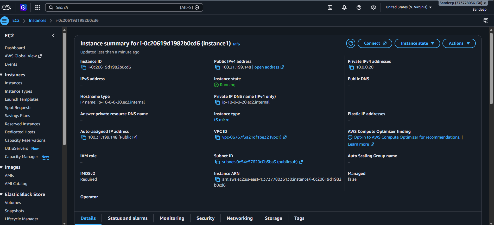
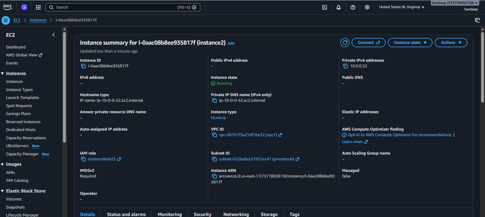
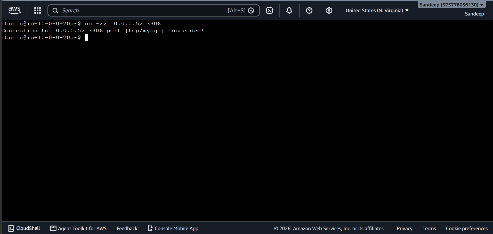
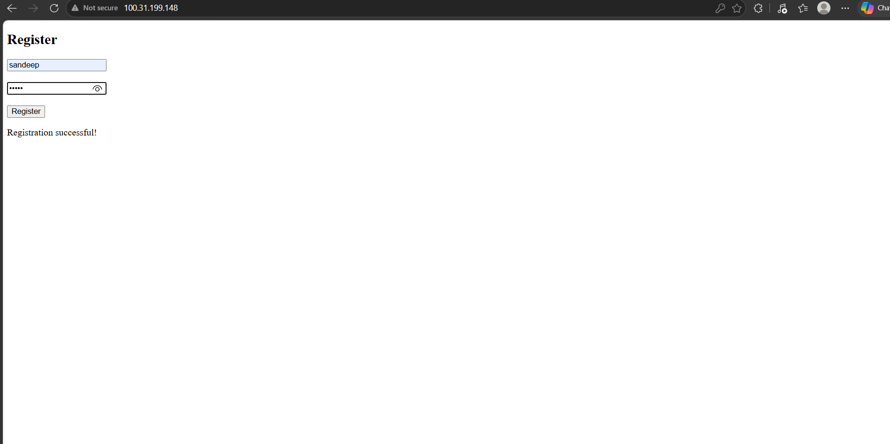
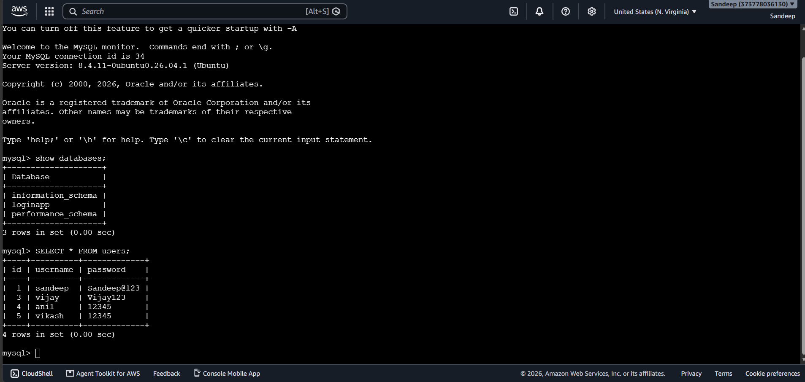

# AWS 3-Tier Web Application Architecture

A secure, decoupled 3-tier web application deployed on Amazon Web Services (AWS). The project demonstrates cloud architecture best practices by isolating application tiers within a custom Virtual Private Cloud (VPC), placing the web presentation layer in a public subnet and securing the database tier inside a private subnet with zero direct public internet exposure.

---

## Table of Contents

- [Project Overview](#project-overview)
- [Architecture](#architecture)
  - [Architecture Diagram](#architecture-diagram)
  - [Network & Subnet Topology](#network--subnet-topology)
  - [Tier Breakdown](#tier-breakdown)
- [AWS Services Used](#aws-services-used)
- [How the Application Works](#how-the-application-works)
- [Database Information](#database-information)
- [Security Configuration](#security-configuration)
- [Project Structure](#project-structure)
- [Screenshots](#screenshots)
- [Technologies Used](#technologies-used)
- [Key Learning Outcomes](#key-learning-outcomes)

---

## Project Overview

This project implements a multi-tier cloud infrastructure designed for security, network isolation, and scalability on AWS. 

Instead of hosting the web server and database together on a single public machine, this deployment divides workloads across dedicated EC2 instances:
1. **Presentation / Web Tier**: Accessible to the internet via an Internet Gateway to serve user registration requests.
2. **Database Tier**: Hosted in an isolated private subnet, accessible only by internal traffic originating from the authorized web tier instance over private IP networking.

---

## Architecture

### Architecture Diagram



### Network & Subnet Topology

| Resource | Resource Name / ID | CIDR / IP | Availability Zone | Routing / Access |
| :--- | :--- | :--- | :--- | :--- |
| **VPC** | `vpc1` (`vpc-06767f3a21df1be32`) | `10.0.0.0/16` | Multi-AZ | Main VPC Network |
| **Public Subnet** | `publicsub` (`subnet-0e54e57620c0b5ba3`) | `10.0.0.0/24` range | `us-east-1a` | Route table directs `0.0.0.0/0` to Internet Gateway (`myinternet`) |
| **Private Subnet** | `privatesub` (`subnet-032ba0ce51957ec47`) | `10.0.0.0/24` range | `us-east-1b` | Route table directs outbound internet traffic to NAT Gateway (`mynatgate`) |
| **Internet Gateway** | `myinternet` | N/A | N/A | Enables bidirectional internet access for the public subnet |
| **NAT Gateway** | `mynatgate` | N/A | `us-east-1a` | Enables outbound-only internet connectivity for private subnet |

### Tier Breakdown

1. **Presentation / Web Tier (`instance1`)**:
   - **Instance ID**: `i-0c20619d1982b0cd6`
   - **Instance Type**: `t3.micro`
   - **Availability Zone**: `us-east-1a`
   - **Public IPv4**: `100.31.199.148`
   - **Private IPv4**: `10.0.0.20`
   - **Role**: Serves the PHP registration interface (`index.php`) and handles incoming HTTP client requests.

2. **Database Tier (`instance2`)**:
   - **Instance ID**: `i-0aac08b8ee935817f`
   - **Instance Type**: `t3.micro`
   - **Availability Zone**: `us-east-1b`
   - **Public IPv4**: None (No public IP assigned)
   - **Private IPv4**: `10.0.0.52`
   - **IAM Role**: `instanceRole22`
   - **Role**: Runs MySQL Server 8.4, storing user credentials submitted through the application.

---

## AWS Services Used

- **Amazon Virtual Private Cloud (VPC)**: Custom virtual network (`vpc1`) isolating cloud resources with an allocated `10.0.0.0/16` CIDR block.
- **Amazon VPC Subnets**: Public (`publicsub`) and private (`privatesub`) subnets distributed across availability zones (`us-east-1a` and `us-east-1b`).
- **Amazon Elastic Compute Cloud (EC2)**: Two Ubuntu-based `t3.micro` virtual compute instances hosting the web application and MySQL database.
- **Internet Gateway (IGW)**: `myinternet`, enabling external connectivity between the public subnet and the internet.
- **NAT Gateway**: `mynatgate`, allowing instances in the private subnet to securely reach external services without exposing private IP addresses.
- **VPC Route Tables**: Defined routing paths directing external traffic to `myinternet` and private egress to `mynatgate`.
- **AWS Security Groups**: Virtual firewalls controlling ingress and egress network traffic for both web and database instances.
- **AWS Identity and Access Management (IAM)**: Instance profile (`instanceRole22`) assigned to backend compute resources.

---

## How the Application Works

1. **User Request**: A client accesses the web application via browser at `http://100.31.199.148`.
2. **Form Presentation**: The Apache/PHP web server on `instance1` (`10.0.0.20`) executes `index.php` and presents a registration form with fields for `Username` and `Password`.
3. **Database Connectivity**:
   - When the user submits the form via `POST`, `index.php` initiates a MySQL connection to the internal database host at `10.0.0.52:3306`.
   - The connection uses the `mysqli` client extension configured for the `loginapp` database.
4. **Table Auto-Creation**:
   - The script verifies that the destination table exists using `CREATE TABLE IF NOT EXISTS users (...)`.
5. **Secure Record Insertion**:
   - The application binds user inputs using prepared statements:
     ```php
     $stmt = $conn->prepare("INSERT INTO users (username, password) VALUES (?, ?)");
     $stmt->bind_param("ss", $username, $password);
     $stmt->execute();
     ```
6. **User Feedback**:
   - Upon execution, the server outputs `Registration successful!` directly to the client interface.
   - The statement and database connections are closed cleanly.

---

## Database Information

- **Database Engine**: MySQL Server
- **Version**: `8.4.11-0ubuntu0.26.04.1 (Ubuntu)`
- **Host Address**: `10.0.0.52` (Private subnet IP)
- **Port**: `3306`
- **Database Name**: `loginapp`
- **Application User**: `appuser`
- **Table Name**: `users`

### Table Schema

```sql
CREATE TABLE IF NOT EXISTS users (
    id INT AUTO_INCREMENT PRIMARY KEY,
    username VARCHAR(100) NOT NULL,
    password VARCHAR(255) NOT NULL
);
```

### Verified Database Content

Inspections via the MySQL interactive monitor confirm data persistence across tier boundaries, showing registered user records created through the frontend form.

---

## Security Configuration

- **Zero Public Exposure for Database**: `instance2` has no public IPv4 address and cannot be accessed directly from the internet.
- **Network Isolation via Private Subnet**: The database resides in `privatesub`, protected behind VPC routing tables that prohibit inbound internet gateway traffic.
- **Controlled Ingress Access**: Port `3306` (MySQL) on the database host is restricted to accept incoming traffic solely from the web server private IP (`10.0.0.20`).
- **Network Verification**: Connectivity between the tiers was validated using `nc -zv 10.0.0.52 3306` directly from the web server instance.
- **SQL Injection Defense**: Prepared statements with parameterized queries (`bind_param`) in PHP prevent SQL injection attacks.
- **IMDSv2 Enforcement**: Instance Metadata Service Version 2 (`IMDSv2`) is set to **Required** on all EC2 instances to mitigate SSRF vulnerability risks.
- **Principle of Least Privilege**: The application accesses the database through a dedicated service user (`appuser`) scoped to the `loginapp` database.

---

## Project Structure

```
aws-3-tier-web-app/
├── README.md                                  # Project documentation
├── index.php                                  # Frontend form and backend database logic
└── screenshots/                               # Architecture and deployment verification
    ├── EC2-instances.png                      # Running EC2 instances overview
    ├── database-users.png                     # MySQL users table queries
    ├── private-db-connection.png              # Netcat connectivity test from web to DB
    ├── security-groups-of-private-ec2.png     # Private instance network & IAM configuration
    ├── security-groups-of-public-ec2.png      # Public instance network & IP configuration
    ├── vpc-architecture.png                   # VPC resource map and route connections
    └── working-website.png                    # Live web application registration test
```

---

## Screenshots

### 1. VPC Architecture & Resource Map
Shows VPC `vpc1` (`10.0.0.0/16`), public and private subnets (`publicsub`, `privatesub`), route tables, Internet Gateway (`myinternet`), and NAT Gateway (`mynatgate`).



---

### 2. EC2 Instances Overview
Displays both running EC2 instances (`instance1` and `instance2`) configured as `t3.micro` across availability zones `us-east-1a` and `us-east-1b`.



---

### 3. Public Web Server (`instance1`)
Shows public IPv4 address `100.31.199.148`, private IP `10.0.0.20`, and association with `publicsub`.



---

### 4. Private Database Server (`instance2`)
Confirms absence of public IP address, assignment to private IP `10.0.0.52` in `privatesub`, and attached IAM role `instanceRole22`.



---

### 5. Private Database Connectivity Test
Demonstrates successful TCP handshake on port 3306 from web server (`10.0.0.20`) to database host (`10.0.0.52`) using `nc -zv`.



---

### 6. Working Web Application
Demonstrates the live registration page loaded over HTTP (`100.31.199.148`) returning a successful registration message upon form submission.



---

### 7. Database Verification
Shows the MySQL CLI session in Ubuntu on the database server verifying database `loginapp` and records stored in table `users`.



---

## Technologies Used

- **Cloud Platform**: Amazon Web Services (AWS)
- **Compute**: AWS EC2 (`t3.micro`)
- **Networking**: AWS VPC, Public/Private Subnets, Internet Gateway, NAT Gateway, Custom Route Tables
- **Operating System**: Ubuntu Linux
- **Web Server & Backend**: PHP, Apache
- **Database**: MySQL Server 8.4 (`8.4.11-0ubuntu0.26.04.1`)
- **Networking Tools**: Netcat (`nc`)
- **Security**: AWS Security Groups, AWS IAM, IMDSv2

---

## Key Learning Outcomes

1. **Custom VPC Design**: Built a custom virtual network with customized CIDR blocks (`10.0.0.0/16`) and multi-AZ subnet segmentation.
2. **Public vs. Private Subnet Routing**: Designed route tables routing internet-bound traffic through an Internet Gateway for the public subnet and a NAT Gateway for outbound egress from the private subnet.
3. **Defense-in-Depth Architecture**: Eliminated attack surfaces by placing sensitive persistence layers in private subnets with no public IPv4 allocation.
4. **Inter-Tier Networking**: Established and diagnosed secure inter-instance communication between Linux hosts using private IP addresses and Netcat (`nc`).
5. **Full-Stack Cloud Integration**: Connected an Apache/PHP web application to an isolated relational database tier using secure MySQLi prepared statements.
6. **Cloud Workload Hardening**: Enforced modern cloud hardening standards, including IMDSv2 requirement and least-privilege credential practices.
